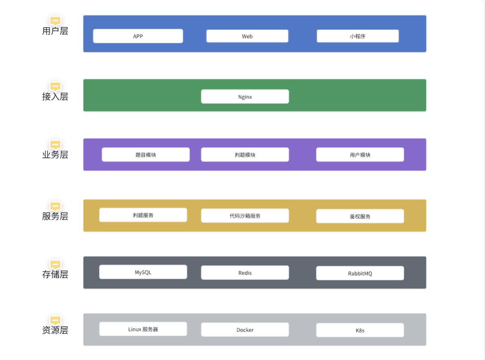
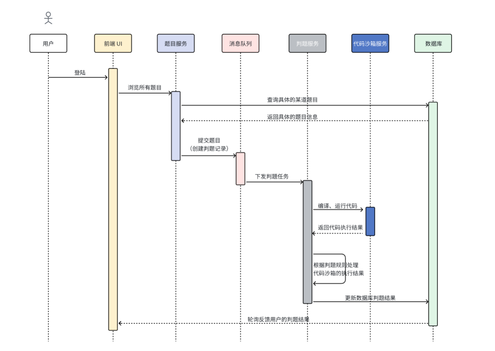

## gyu_oj_platform

一个在线判题平台，自研代码沙箱，支持编译、运行 golang 代码，为 Gopher 开发者提供良好的自我提升刷题体验。

实现功能包括：
- 用户注册、用户登录、用户退出；
- 普通用户浏览题目、提交代码、查看提交记录，查看代码运行结果；
- 管理员添加、修改、删除题目
- 编译，运行 Golang 代码
- 代码评测，样例校验

## 技术栈
前端：Vue3 + Arco Design 组件库

后端：
- 语言：Golang + go-zero 框架 + Gorm + gRPC
- 数据库：MySQL
- 缓存：Redis
- 消息队列：RabbitMQ
- 网关：Nginx
- 链路追踪：Jaeger
- 服务监控：Prometheus + Grafana
- 容器：Docker + Docker Compose
- 热编译工具：modd

## 后端项目总览

### 项目架构


### 核心业务时序



### 项目快速启动
0，启动独立服务 gyu_oj_sandbox，为 gyu_oj_platform 做准备；  
- 拉取项目：
  ```bash
  git clone git@github.com:GyuXiao/gyu-oj-sandbox.git
  ```
- 配置 rpc/etc/sandbox.yaml 文件中的 SandboxBy.Type，默认是 golang；
- 不同配置的优缺点：
    - golang：响应速度快，但安全性不如 docker
    - docker：响应速度不如 golang 原生，但安全性较高
- 启动项目（建议在 linux 环境下）：
  ```bash
  modd
  ```
1，启动 gyu_oj_backend 项目
- 拉取项目：
  ```bash
  git clone git@github.com:GyuXiao/gyu_oj_platform.git
  ```
- 先配置运行环境：
  - 修改 docker-compose-env.yml 文件的
      - mysql_password
      - redis_password
  - 修改 app/user/rpc/etc/user.yaml 文件的
      - mysql_password
      - redis_password
  - 修改 app/question/rpc/etc/question.yaml 文件的
      - mysql_password
  - 修改 app/judge/rpc/etc/judge.yaml 文件的
      - CodeSandbox.Url
- 容器化启动项目：
  ```bash
  # 先启动环境
  docker-compose -f docker-compose-env.yml up -d
  # 再启动项目
  docker-compose -f docker-compose.yml up -d
  ```
>说明：password 的话，根据开发者喜好设置，Url 则是 gyu_oj_sandbox 服务所在的网络

2，启动 gyu_oj_frontend 项目
- 环境要求：
  - node: v18.16.0
  - npm: 9.5.1
  - @vue/cli 5.0.8
- 进入 gyu_oj_frontend 项目，在根目录执行
  ```bash
  npm run serve
  ```


